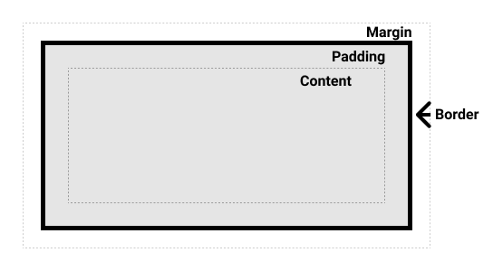
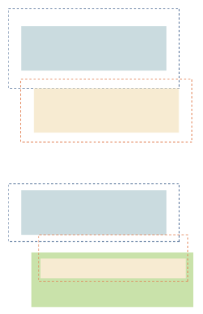

<!-- _class: lead -->

# **Практика №2: CSS**

Web-программирование / ПГНИУ

---

# HTML: атрибуты id, class

- `id` - универсальный атрибут уникального идентификатора элемента
- `class` - универсальный атрибут со списком имен классов (через пробел), к которым принадлежит элемент

```html
<p class="paragraph line"></p>
<p id="second-paragraph" class="paragraph"></p>
<p class="last__line SomeClass__nam-e-5"></p>
```

---

# CSS

- Cascading Style Sheets
- Каскадные таблицы стилей
- Формальный язык иерархических правил (каскадных таблиц), используемый для представления внешнего вида документа, написанного с использованием языка разметки

---

# Синтаксис

* Состоит из **стилей** и **@-правил**
* Стили - множество правил
* ```
    Правило ::= selectorlist {
        property : value ;
        [ property : value ; ]*
    }
    ```
* `selectorlist ::= selector [, selector ]*`

---

# Стили

Стили определяют разные свойства элемента, которые влияют на его внешний вид и на поведение рендеринга (положение элемента и его влияние на положение других элементов).

Многие свойства наследуются и переопределяются каскадно. 

---

# Селектор

* Селектор определяет множество элементов, на которые действует правило
* Базовые селекторы:
    - по тегу: `tagname`
    - по классу: `.class-name`
    - по идентификатору: `#id`
* Универсальный: `*` - все элементы
* Мультиклассы: `tag.class1.class2`, `#id.class1.class2`

---

# Комбинационные селекторы

* Потомок: `x y`
Выбрать все `y`, являющиеся потомками `x`
* Смежный: `x ~ y`
Выбрать все `y`, являющиеся смежными (на одном уровне) с `x`
* Следующий: `x + y`
Выбрать все `y`, находящиеся непосредственно после `x`
* Непосредственно дочерний: `x > y`
Выбрать все `y`, являющиеся дочерними для `x`

---

# Селекторы по атрибутам

- `[attr]` – имеет атрибут `attr`
- `[attr='value']` – имеет атрибут `attr` со значением `value`
- `[attr^='value']` – … начинающийся на `value`
- `[attr$='value']` – … заканчивающийся на `value`
- `[attr*='value']` – … содержащий подстроку `value`
- `[attr~='value']` – … содержащий `value` в списке
- `[attr|='value']` – … содержащий `value` в списке с дефисом

---

# Псевдоэлементы

* Определяют особые части элементов
* `::after`, `::before` – часть после/до
* `::backdrop` – верхний элемент по оси Z
* `::first-letter` – первая буква
* `::first-line` – первая строка
* `::placeholder` – плейсхолдер полей ввода
* `::selection` - выделение

---

# Псевдоклассы

* Селекторы, обозначающие состояние элемента
* `:root`
* `:active`, `:focus`
* `:checked`, `:disabled`
* `:hover`
* `:not(selector)`
* `:empty`
* `:first-child`, `:last-child`
* `:nth-child(odd | even | <число> | <выражение>)`

---

# Примеры селекторов

* `*`
* Все элементы
* `p, div.paragraph`
* Параграфы и элементы `div` с классом `paragraph`
* `#navbar a:active`, `#navbar a:focus`
* Активные ссылки и ссылки в фокусе в эл. с `id="navbar"`
* `input[type="checkbox"]:checked + label`
* `label`, который идёт сразу за выбранным чекбоксом

---

# Блочная модель

- Каждый элемент в HTML документе представлен прямоугольным блоком
- **Box = Content box + Padding box + Border box  + Margin box**
- Тип блока определяет:
    - **внешний тип отображения**, т.е. расположение блока в потоке элементов
    - **внутренний тип отображения**, т.е. расположение дочерних элементов

---



---

# Виды блоков

* Блочный (**block box**)
    - занимает всю доступную ширину
* Строчный (**inline box**) 
    - часть текста
    - высота = высота строки текста
    - выравнивается относительно текста.
* Блочно-строчный (**inline-box**)
    - размер определяется содержимым, как у блока
    - но обтекается окружающими элементамии, как строчный

---

# Виды блоков

* Таблица и её элементы (**table**, **table-row**, **table-cell**...)
* Список (**list-item**)
* Гибкий (**flexible box**, **flex layout**) - одномерный направленный макет с растяжимыми элементами
* Сетка (**grid layout**) - макет с двумерной сеткой

---

# Основные группы свойств

* Блочная модель (контент, отступы, поля, границы, размер)
* Свойства текста, шрифта
* Свойства фона
* Свойства позиционирования
* Анимация
* И др.

---

# Поля и отступы | padding & margin

* Отступ внутри блока
    - `padding-left: value;` (-right, -top, -bottom)
    - `padding: top right bottom left;`
    - `padding: vertical horizontal;` 
* `margin` – аналогично отступ снаружи
* `margin` может быть отрицательным
* Особое значение - `auto`

---

# Схлопывание отступов

- Наружные отступы могут перекрываться, кроме случаев:
    - есть внутренний отступ или граница
    - вне основного потока блоков
    


---

# Граница | border

* Ширина: `border-width: ширина`
* Стиль: `border-style: solid | dashed | dotted …;` 
* Цвет: `border-color: цвет`
* Скругление углов: `border-radius`
* `border: width style color;`
* `-left, -right, -top, -bottom`

---

# Размер

* `width`, `height` – ширина и высота
* `box-sizing` – определяет, какой части устанавливается размер
    - контенту
    - целиком с внутренним отступом и рамкой

---

# Свойства текста и шрифта

* Стили текста (выравнивание, подчёркивание, отступы, тень, переносы)
* `text-align, text-decoration, text-indent, text-shadow...`, `word-break, white-space`
* Стили шрифта (семейство, размер, жирность, цвет и т.д.)
* `font-family, font-size, font-weight...`, `color` 
* Высотка строки: `line-height`

---

# Фон | background

* Цвет: `background-color`
* Изображение: `background-image`
* Позиция: `background-position`
* Повтор: `background-repeat`
* Область: `background-origin`
* Размер (заполнение): `background-size`
* `background: image position \[ / size \]? repeat attachment origin clip`

---

# Position

* `static` – обычное положение объекта
* `relative` – относительное положение. Можно изменять место рендера элемента, хотя в мест элемент занимает где должен
* `absolute` – отдельный поток рендеринга, объект поверх основного потока. Позиция относительно документа или ближайшего relative
* `fixed` – аналогично absolute, но относительно окна
* `sticky` (не стандарт) – фиксированный в определённой области (родителе)
* За позицию отвечают свойства: `top, left, right, bottom`
* `z-index` – позиция по оси Z при накладывании

---

# Другие свойства

* `cursor` – курсор над элементом
* `opacity` – прозрачность
* `box-shadow` – тень
* `overflow` – что делать, если контент не помещается
* `transform` – различные трансформации
* `transition` – плавное изменение свойств
* `display` – тип блока
* `float` – плавающий блок в тексте

---

# Значения

* Относительные единицы измерения: `px`, `%`, `em`, `rem`, `vh`, `vw` (`10px`)
* Абсолютные единицы измерения: `in`, `cm`, `mm`, `pt`, `pc`
* Числа, строки: `1`, `5.0`, `"string"`
* Для `0` не требуется единицы измерения
* Цвета: `#hex`, название (red, blue), `rgb(r, g, b)`, `rgba(r, b, g, a)`, `hsl(h, s, l)`, `transparent`
* Зарезервированные значения
* `initial`, `inherit`, `none`
* Значение с параметрами (функции), `calc(100% - 10px)`, `minmax()`, `var()`, `attr()`, `brightness()`

---

# Пользовательские свойства

* Aka CSS-переменные
* Любые свойства, начинающееся на `--`
* Наследуется на все дочерние элементы
* Получить значением можно из функции `var()`

---

# Пользовательские свойства

```css
:root { 
  --base-size: 100px;
}

main {
  --base-size: 200px;
  --base-spacing: 10px;
  --danger-color: red;
}

button {
  color: var(--danger-color);
  width: calc(var(--base-spacing) + var(--base-width));
}
```

---

# @-правила

- `@charset "utf-8";`
- `@media` – медиа запросы
- `@font-face` – подключение шрифта
- `@keyframes` – шаги анимации
- `@import` – импорт других таблиц стилей

---

# @media

```css
@media screen and (min-width: 1000px) {
  main {
    width: 1000px;
  }
}
```

---

# Подключение стилей

- Подключение отдельного файла
- В элементе `style`
- Inline-стили в атрибуте `style`
```html
<link href="path/to/style.css" rel="stylesheet" />
<style>/* Some css */</style>
<div style="color: red; font-size: 10px;"></div>
```

---

<!-- _class: lead -->

# На самостоятельное изучение

* Приоритет правил в CSS;
* Наследование свойств;
* Потоки рендеринга, особенности float, position;

---

# Ссылки

- Спецификация по CSS: https://www.w3.org/Style/CSS
- Гайд по CSS от MDN: https://developer.mozilla.org/ru/docs/Learn/CSS
- Документация по CSS от MDN: https://developer.mozilla.org/ru/docs/Web/CSS/Reference
- CSS Layouts от MDN (про потоки рендеринга): https://developer.mozilla.org/ru/docs/Learn/CSS/CSS_layout
- "Для чайников": https://webref.ru/

---

<!-- _class: lead -->

# In the next episode

Flex-box и вёрстка: подходы, best practices
